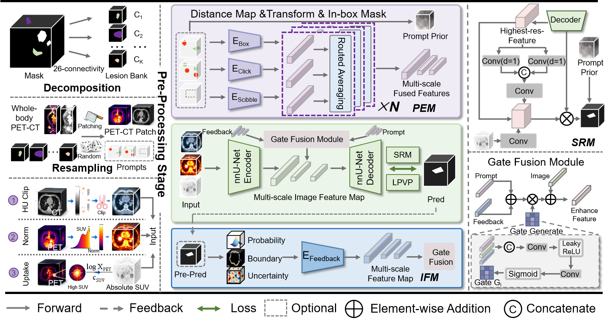
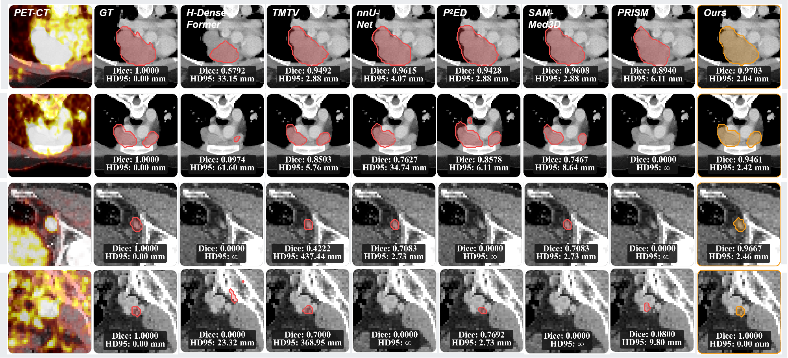
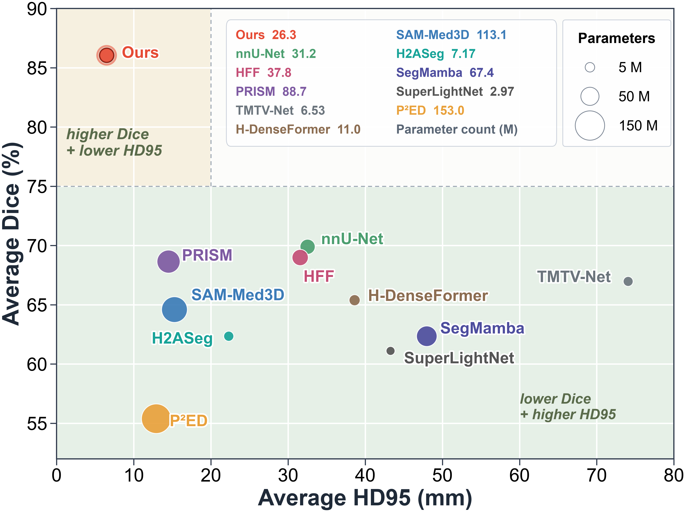

# LINet: Lesion-Aware Interactive Network for Whole-Body PET/CT Tumor Segmentation

Official research implementation for **LINet**, a 3D PET/CT interactive
segmentation model for whole-body, multi-lesion tumor segmentation. LINet
keeps the complete lesion map as the prediction target; a click, bounding box,
or scribble prioritizes local refinement without discarding unprompted lesions.

> This repository contains source code only. Medical images, patient metadata,
> trained checkpoints, and split files are deliberately not included.

## Method

The network uses CT, normalized PET, and an absolute log-SUV channel. It adds
four lesion-aware components to a residual nnU-Net encoder-decoder:

- **PEM**: isolated prompt experts for click, box, and scribble inputs.
- **GFM**: gated fusion of image, prompt, and previous-prediction features.
- **IFM**: iterative feedback from probability, uncertainty, and soft-boundary
  maps.
- **SRM**: SUV-guided full-resolution detail refinement for small lesions.

Training uses Dice + BCE with deep supervision and the physical-volume- and
prompt-aware Tversky (PVP-Tversky) objective. Prompt sampling is lesion-aware;
all annotated lesions in the sampled patch remain foreground supervision.

## Visual overview

### LINet architecture



### Segmentation examples



### Accuracy, boundary quality, and model size



## Paper results

The following are the results reported in `TIP_LINet.pdf`, evaluated on the
complete lesion map under the one-click protocol. They are paper results, not
claims that a fresh run will reproduce them without the same data splits,
preprocessing, hardware, and random seeds.

| Dataset | Dice (%) | PPV (%) | Sensitivity (%) | HD95 (mm) |
| --- | ---: | ---: | ---: | ---: |
| AutoPET FDG | 83.96 +/- 14.40 | 83.98 +/- 12.53 | 85.15 +/- 12.35 | 9.92 +/- 17.47 |
| AutoPET PSMA | 80.47 +/- 14.76 | 90.52 +/- 15.75 | 70.65 +/- 16.56 | 6.19 +/- 12.07 |
| Deep PSMA | 93.72 +/- 11.29 | 83.91 +/- 12.27 | 86.99 +/- 18.55 | 3.32 +/- 7.47 |

Reported data splits are patient-level 7:2:1: FDG 364/87/50,
AutoPET PSMA 376/109/54, and Deep PSMA 70/20/10 (train/validation/test).

## Installation and verification

```bash
pip install -r requirements.txt
python -m unittest discover -s tests -v
```

The tests use synthetic volumes and do not require medical data or a GPU.

## Data layout

Use an nnU-Net-style layout. The default convention is CT as `_0000` and PET
SUV as `_0001`; change the suffixes when a dataset uses the reverse order.

```text
data3d/
  imagesTr/
    <case>_0000.nii.gz   # CT
    <case>_0001.nii.gz   # PET SUV
  labelsTr/
    <case>.nii.gz        # binary lesion mask
  split.json             # patient-level train/val split
```

`split.json` may be an nnU-Net split list (for example, a list whose first
entry contains `"train"` and `"val"` case-ID arrays). Do not commit image data,
labels, or patient-level split files.

## Training

Create the offline cache first. It stores connected-lesion information and
prompt geometry, while generated data stay outside version control.

```bash
python cache.py build --profile full \
  --images-dir /path/to/imagesTr \
  --labels-dir /path/to/labelsTr \
  --split-json /path/to/split.json \
  --cached-lesions-per-case 8 --no-bank

python train.py --profile full \
  --images-dir /path/to/imagesTr \
  --labels-dir /path/to/labelsTr \
  --split-json /path/to/split.json \
  --output-dir runs/autopet_fdg --cache required
```

The `full` profile follows the paper's core optimization configuration: 128^3
patches, batch size 1, two-step gradient accumulation, FP16 AMP, AdamW
(learning rate 2e-4; weight decay 1e-4), and polynomial learning-rate decay.
Use `--ct-suffix` and `--pet-suffix` for modality-order changes.

## Inference

Automatic whole-volume segmentation:

```bash
python inference.py --ct CT.nii.gz --pet PET.nii.gz \
  --checkpoint runs/autopet_fdg/best.pth --output prediction.nii.gz
```

For local interactive refinement, pass `--prompts-json prompts.json`. It is a
list of interactions in source-image voxel coordinates, for example:

```json
[
  {"pos": [[120, 160, 80]]},
  {"neg": [[135, 172, 82]]},
  {"bbox": [100, 130, 60, 145, 185, 105]}
]
```

The inference program saves the binary mask and a `_prob.nii.gz` probability
map. `--auto-output` also writes the unrefined automatic mask.

## Repository structure

```text
model.py       LINet architecture (PEM, GFM, IFM, SRM)
data.py        PET/CT loading, resampling, lesion and prompt sampling
losses.py      Dice/BCE and PVP-Tversky supervision
cache.py       offline lesion and patch cache
engine.py      training, correction rounds, evaluation
train.py       training entry point
inference.py   automatic and prompted whole-volume inference
tests/         synthetic unit tests
```

## Citation

If you use this code, please cite the accompanying manuscript:

```text
Changwei Wu, Yifei Chen, Xiangshuang Li, Chenke Li, Beining Wu,
Mingxuan Liu, Xiaxuan Chen, Feiwei Qin, and Qiyuan Tian.
LINet: A Lesion-Aware Interactive Network for Whole-Body PET/CT Tumor
Segmentation.
```
